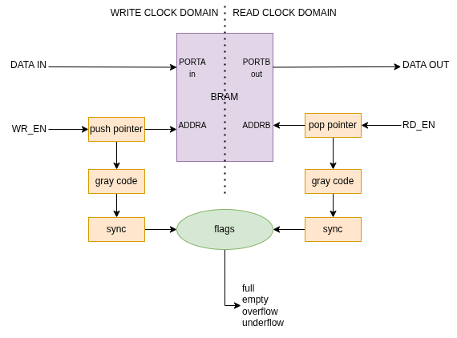

# async_fifo

> **version: 1.0**

### Description:
Double clock asynchronous FIFO with native interface for FPGA projects. Verilog and VHDL Versions.

### Catalog Structure:
- **doc** - documents;
- **async_fifo_verilog** - async_fifo verilog version;
  - **src** - sources verilog files;
  - **sim** - script files for modelsim/questasim;
  - **tb** - testbenches;
- **async_fifo_vhdl** - async_fifo vhdl version;
  - **src** - sources vhdl files;
  - **sim** - script files for modelsim/questasim;
  - **tb** - testbenches;

:exclamation: To set the FIFO depth and width, you must specify **FIFO_DEPTH** and **DATA_WIDTH** parameters
in the top project file (**async_fifo.v** or **async_fifo.vhd**).

### Block Diagram:
